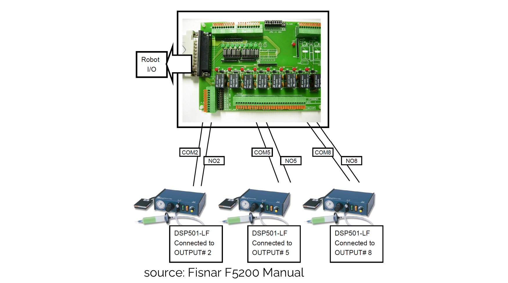
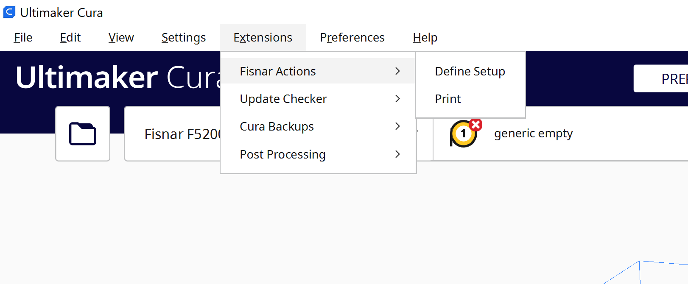
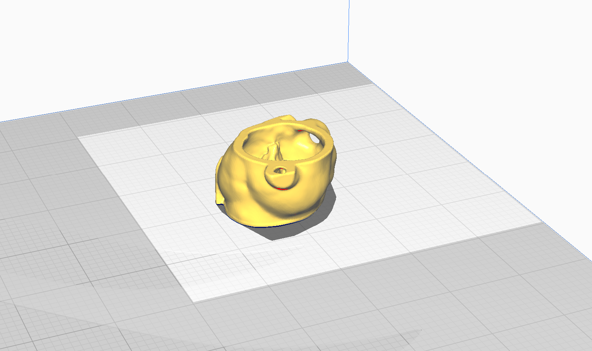
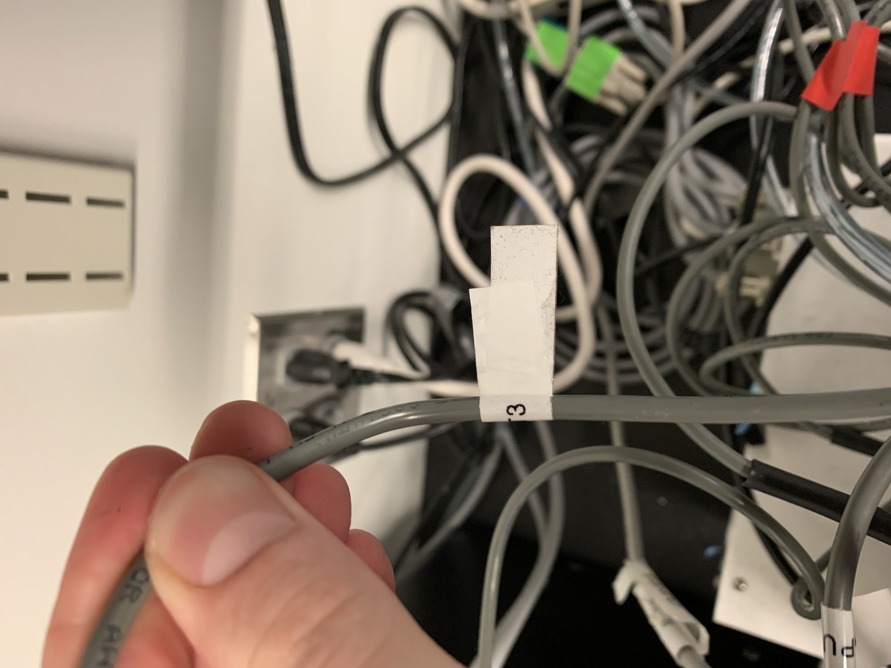
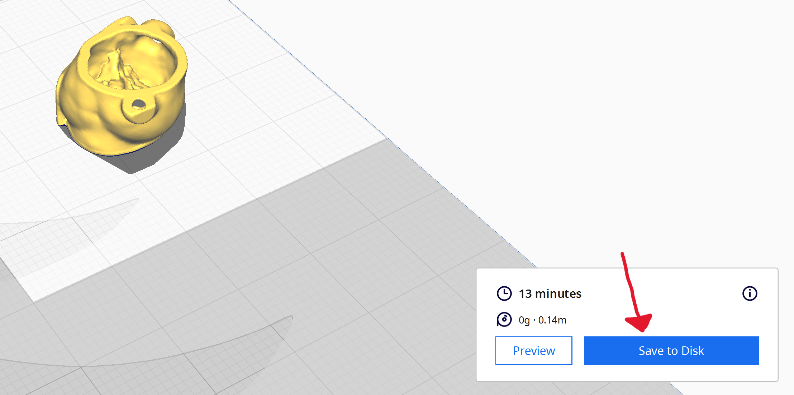
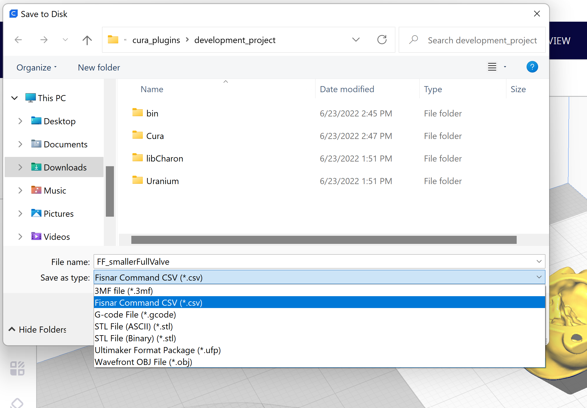
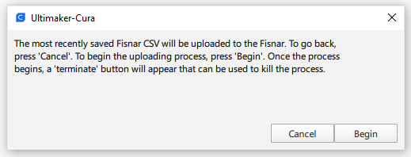
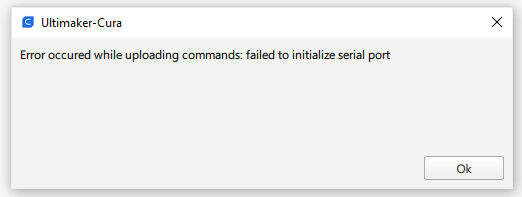

# FisnarRobotPlugin
Fisnar Robot Plugin adds the Fisnar F5200N dispensing robot to Cura,
allows slicer output to be saved in the Fisnar command .csv format, and
enables 'USB' printing using the F5200N's RS232 port.

# Table of Contents
- [Introduction](##Introduction)
- [Installation Instructions](##Installation-and-Initial-Setup)
- [Physical Setup Needed](##Necessary-Physical-Printer-Configuration)
- [Using the Plugin](##Using-the-Plugin)
- [Technical Details](##Technical-Details)
- [Contact Info](#Contact)

## Introduction
FisnarRobotPlugin is a plugin for [Ultimaker Cura](https://ultimaker.com/software/ultimaker-cura) version 5.0.0+. Broadly speaking, it makes the Fisnar F5200N
robot compatible with Cura. This plugin contains the necessary files to add
the Fisnar F5200N printer to Cura and enables exporting slicer output in the
Fisnar .csv format. Additionally, this plugin allows the user to print
with the Fisnar F5200N over the RS232 port, which eliminates any command limit
issues sometimes seen with Fisnar's proprietary command upload software ('Smart
Robot Edit').

A lot of this plugin was written using other existing plugins as guides. This
includes Ultimaker's [GCodeWriter](https://github.com/Ultimaker/Cura/tree/main/plugins/GCodeWriter) plugin and Tim Schoenmackers' [Dremel Printer](https://github.com/timmehtimmeh/Cura-Dremel-Printer-Plugin) plugin.

If you find any bugs/issues or have suggestions for this plugin, contact me
using the info below or use one of the GitHub communication features.

Lastly, the development of this plugin was funded by the [McAlpine Research
Group](https://sites.google.com/view/mcalpineresearchgroup/home) at the University of Minnesota.

## Installation and Initial Setup
This plugin has been submitted to the [Ultimaker Marketplace](https://marketplace.ultimaker.com/app/cura/plugins) and as of now (6/29/2022) it is under review. Until it is accepted, the only way to install it is by packaging it
from source. Instructions to do so can be found [here](https://community.ultimaker.com/topic/26046-writing-a-custom-cura-package/).

Once the plugin is accepted, a more user-friendly description of how to download
it will be provided.

After installing the plugin, the Fisnar F5200N printer has to be added
before the plugin can be used. First, go to

## Necessary Physical Printer Configuration
In order to use this plugin, the Fisnar F5200N in use needs to be using an
i/o card to control its outputs. This i/o card can be purchased from Fisnar,
and is pictured below.

The format of the exported Fisnar .csv file depends on whether
an i/o card is being used or not. In order to support using multiple
dispensers, this plugin assumes that the i/o card is being used. Also, it
is impossible to control the Fisnar over the RS232 port without using
an i/o card. In the future, the ability to export Fisnar .csv files for use
without an i/o card will likely be added.

Additionally, if you want to print over the RS232 port, the Fisnar needs to be
connected to the computer running Cura using an RS232-to-USB cable. This
method of printing is recommended, because it circumvents the command limit
issue seen with Fisnar's proprietary command uploading software.

## Using the Plugin
All features of the plugin can accessed from the extensions menu found on
the top-left menu bar in Cura (extensions -> Fisnar Actions).

There are two sub-menus under the 'Fisnar Actions' tab: 'Define Setup' and
'Print'. The 'Define Setup' menu is used to enter information about the
physical printing setup being used, and the 'Print' menu is used to initiate
printing over the RS232 port.

### Entering Setup Information
Clicking on the 'Define Setup' tab brings up the following dialog:

This is where the print surface, extruder-output, and COM port information
can be entered.

#### Print Surface

The print surface info sets the x, y, and z boundaries for the print surface
in use. It should be noted that the Fisnar coordinate system is inverted to
the coordinate system used in Cura - the print surface coordinates should be
in the Fisnar coordinate system. This allows the Fisnar teach pendant to be used
to probe the surface and get the boundary values.

The 'z-maximum' entry is by far the most important - this defines the height of
the printing surface. Too low of a z-value means the print will start in mid-air,
and too high of a z-value means the nozzle will slam into the build surface (the +z axis points downward). The
'z-maximum' value is used to convert the Cura coordinate system to the Fisnar
coordinate system when exporting to Fisnar .csv.

The x and y boundary values are not used during the file export process, but
are useful for proper model placement in Cura. When x and y boundary values
are entered, the 'disallowed areas' in Cura are updated. This 'grays out'
the portions of the build plate in Cura that are outside of the print
surface, ensuring that models can only be sliced if they are within the
printable region.

#### Extruder Outputs
The extruder-output values determine which output number on the i/o card
corresponds to which extruder in Cura. The i/o card has labelled outputs
(1 through 4), each of which can be connected to a dispenser and turned
on or off during printing. Assigning an output to each extruder determines
which output number (and therefore which dispenser) will be turned on when
printing a model assigned to that extruder.

The easiest way to set this up is to just assign extruder 1 to output 1,
extruder 2 to output 2, etc. However, being able to change the outputs provides
more flexibility in case certain output ports aren't functioning properly.

For example: if a single model is being printed, let's say it is assigned to
extruder 1 in Cura (that is, the model will be printed by extruder 1). In
the physical setup, the dispenser nozzle that corresponds to extruder 1 in
Cura is controlled by the output 4 cable. Then in the 'Extruder Outputs' menu,
output 4 would be selected for extruder 1.

The output cables on the i/o card are labelled as shown below.

#### COM Port
The COM port is simply the COM port that the Fisnar RS232 port is connected
to. This connection is made via an RS232-to-USB adapter cable, connecting
the Fisnar RS232 port to one of the USB ports on the PC Cura is running
from.

The COM port only needs to be entered in order to print over RS232. If the
intent is to slice a model, save the output as a CSV, and copy-and-paste it
into Fisnar's 'Smart Robot Edit' software for uploading, the COM port
setting is irrelevant.

### Saving Output to CSV
Once a model is loaded into Cura and positioned as intended, it can be sliced
by pressing the 'Slice' button in the bottom right corner of the screen.

After slicing, press the 'Save to disk' button that appears. This will open
up the file-saving interface. In the file-saving interface, the 'Fisnar Command CSV' format can be selected (if the machine being used is the Fisnar F5200N, this should be the default selection), which will save the slicer output in a Fisnar .csv file.

### Printing Over RS232 Port
After a set of commands is saved as a Fisnar .csv file, the Fisnar can print them over RS232 by pressing the 'Print' sub-menu under the 'Fisnar Actions' tab.
After pressing 'Print', a message box will appear that explains what will happen
while the Fisnar is printing over RS232. From here, pressing 'Begin' will immediately begin the printing process, and pressing 'Cancel' will exit out of the menu.

After pressing 'Begin', the Fisnar will start printing. While it is printing,
a progress window will show how far along the print is. Also in this progress
window is a 'Terminate' button. If anything goes wrong while printing, pressing
the terminate button will kill the whole process.

If an error occurs during or before the printing process, printing will halt and an error message like the one below will be shown.

__Important:__ the commands that will be printed are whatever commands were in the
last saved Fisnar .csv file. Simply slicing the model does not queue the commands
to be printed the next time the 'Print' button is pressed. This is because the commands aren't actually generated until the slicer output is saved as a Fisnar .csv.

## Technical Details

### Fisnar CSV Format

\< _coming soon_ \>

## Contact
To report bugs/issues or make suggestions, email me at [spenbert02@gmail.com](mailto:spenbert02@gmail.com), or use one of the GitHub
communication features.
